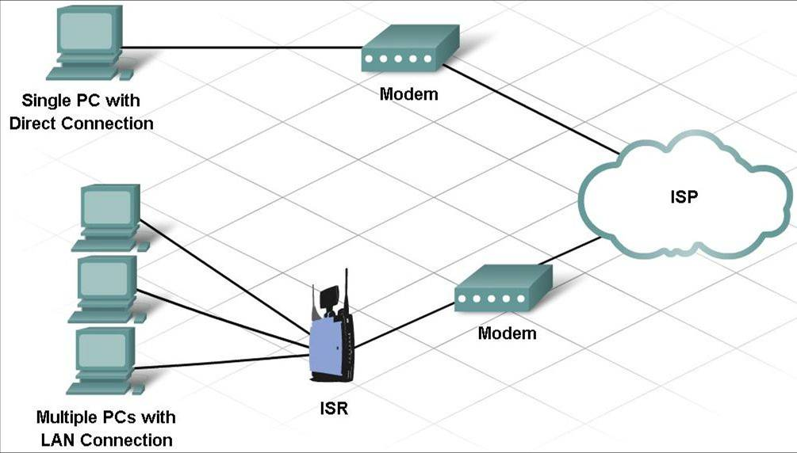

# Conceitos Básicos de Redes

Anotações de estudos sobre os conceitos fundamentais de redes de computadores, transmissão de dados, arquitetura cliente-servidor e infraestrutura de rede.

---

## 1. O Bit e Transmissão de Dados

* **O Bit:** Cada bit pode ter apenas 2 valores: `0` ou `1`. O termo "bit" é uma abreviação de **"dígito binário"** e representa a menor unidade de dados.
  > *Nota:* Um **byte** tem 8 bits, que é a quantidade mínima necessária para representar um caractere completo, de acordo com a tabela ASCII.

### Métodos Comuns de Transmissão de Dados
Depois que os dados são transformados em uma série de bits, eles devem ser convertidos em sinais para que possam ser enviados através da mídia/meio físico:
* **Sinais Elétricos** (ex: cabos de cobre)
* **Sinais Ópticos** (ex: fibra óptica)
* **Sinais Sem Fio** (ex: ondas de rádio / Wi-Fi)

---

## 2. Largura de Banda e Taxa de Transferência

### Largura de Banda (*Bandwidth*)
A **largura de banda** é a capacidade de um meio de transportar dados. A largura de banda digital mede a quantidade de dados que podem fluir de um lugar a outro durante um determinado tempo.

Costuma ser medida pelo número de bits que (teoricamente) podem ser enviados através da mídia em **um segundo**:

| Unidade | Nome | Descrição | Escala |
| :--- | :--- | :--- | :--- |
| **Kbps** | Kilobits por segundo | Milhares de bits por segundo | $10^3$ |
| **Mbps** | Megabits por segundo | Milhões de bits por segundo | $10^6$ |
| **Gbps** | Gigabits por segundo | Bilhões de bits por segundo | $10^9$ |
| **Tbps** | Terabits por segundo | Trilhões de bits por segundo | $10^{12}$ |

### Taxa de Transferência (*Throughput*)
A **taxa de transferência** (*throughput*) é a quantidade real de dados enviados e recebidos em uma conexão em determinado tempo, incluindo atrasos (latência) que possam ocorrer em ambas as direções.

---

## 3. Arquitetura de Rede

### Clientes e Servidores
Todos os computadores conectados a uma rede que participam diretamente da comunicação são classificados como **hosts**. Os hosts podem enviar, receber ou ambos. O software instalado determina qual função o computador desempenha.

```
[ Cliente ] <---------> ( Internet ) <---------> [ Servidor ]
```

* **Servidores:** São hosts que possuem um software instalado que permite fornecer informações à rede (como e-mail ou páginas web). Cada serviço exige um software específico (ex.: um servidor web exige um software de servidor web).
* **Clientes:** São computadores/hosts que possuem softwares que permitem solicitar e exibir as informações obtidas do servidor (ex.: navegadores web como Safari, Chrome, Firefox).

### Rede Ponto-a-Ponto (*Peer-to-Peer*)
A rede ponto-a-ponto mais simples consiste em 2 computadores diretamente conectados por uma conexão com ou sem fio. Ambos os computadores podem atuar tanto como cliente quanto como servidor.

> Vários PCs podem ser conectados para criar uma rede ponto-a-ponto maior, mas isso exige um dispositivo como um **switch** para interconectá-los.
> 
> ⚠️ **Desvantagem:** Pode haver perda de desempenho conforme a rede cresce.

---

## 4. Infraestrutura de Rede

Uma infraestrutura de rede é composta por três categorias principais de componentes:

1. **Dispositivos Finais (*End Devices*):** Computador, laptop, telefone IP, impressora.
2. **Dispositivos Intermediários:** Roteador sem fio (*wireless router*), Switch LAN, dispositivo de Firewall.
3. **Meios de Rede (*Media*):** Meio sem fio (*wireless*), mídia LAN (cabeamento estruturado), mídia WAN.

---

## 5. Serviços de ISP e Conectividade

### Provedor de Serviços de Internet (ISP)
Um **ISP** (*Internet Service Provider*) fornece o link de conexão entre a rede doméstica/empresarial e a Internet. Os ISPs são essenciais para viabilizar a comunicação na Internet global.

### Backbone
Significa **"espinha dorsal"**. Trata-se de uma rede de altíssima velocidade, composta por cabos de fibra óptica de capacidades gigantescas que atravessam continentes e oceanos.
* **Objetivo:** Conectar os diferentes Provedores de Serviços de Internet (ISPs) entre si em nível global.

### Exemplo de Topologia de Conexão ISP

´´´

